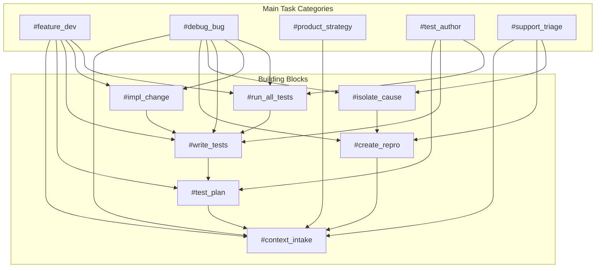

# Prompt Network

This is the **definitive guide** to the tag-based prompt system. Use this as your primary navigation and reference document for all development workflows.

## 🎯 How to Use This System

**The prompt system is designed around two types of prompts:**

1. **Main Task Categories** - Complete workflows for major types of work
2. **Building Blocks** - Composable steps that can be chained together

**Usage Pattern**: `Use #tag_name to accomplish [specific work description]`

## Main Task Categories → Building Blocks



## Complete Workflow Patterns

### 🚀 Feature Development Workflow
```
#context_intake → #test_plan → #write_tests → #impl_change → #run_all_tests
```
**Usage**: `Use #feature_dev to implement user authentication system`

### 🐛 Bug Resolution Workflow  
```
#context_intake → #create_repro → #isolate_cause → #write_tests → #impl_change → #run_all_tests
```
**Usage**: `Use #debug_bug to fix login failure issue`

### 🔍 Support Triage Workflow
```
#context_intake → #create_repro → #isolate_cause → [Route to appropriate fix workflow]
```
**Usage**: `Use #support_triage to investigate customer report of checkout errors`

### 📊 Product Strategy Workflow
```
#context_intake → [Analysis and Planning] → [Feature Development workflows]
```
**Usage**: `Use #product_strategy to plan next quarter feature priorities`

### 🧪 Test Authoring Workflow
```
#test_plan → #write_tests → #run_all_tests → [Iterate based on results]
```
**Usage**: `Use #test_author to improve test coverage for payment system`

## Prompt Composition Patterns

### Sequential Composition (Pipeline)
Use building blocks in sequence for complex workflows:
```
Apply #context_intake, then #test_plan, then #write_tests for the user profile feature
```

### Conditional Composition (Branching)
Choose different paths based on context:
```
For new features: #context_intake → #feature_dev
For bug reports: #context_intake → #debug_bug  
For feedback: #context_intake → #support_triage
```

### Iterative Composition (Loops)
Repeat building blocks until success:
```
#debug_bug workflow: #create_repro → #isolate_cause → #impl_change → #run_all_tests (repeat until tests pass)
```

## Cross-Reference Index

### By Prerequisites
- **No Prerequisites**: #context_intake
- **Needs Context**: #test_plan, #create_repro, #feature_dev, #debug_bug, #product_strategy
- **Needs Tests**: #run_all_tests, #impl_change  
- **Needs Repro**: #isolate_cause
- **Needs Plan**: #write_tests

### By Complexity
- **Simple Building Blocks** (100-200 words): #context_intake, #create_repro, #run_all_tests
- **Complex Building Blocks** (200-300 words): #test_plan, #write_tests, #impl_change, #isolate_cause
- **Main Categories** (300-400 words): #feature_dev, #debug_bug, #product_strategy, #test_author, #support_triage

### By Configuration Needs
- **Highly Configurable**: #feature_dev, #debug_bug, #impl_change (need tech stack, workflows, quality standards)
- **Moderately Configurable**: #test_plan, #write_tests, #run_all_tests (need testing frameworks, patterns)
- **Lightly Configurable**: #context_intake, #create_repro, #isolate_cause (need information sources, tools)
- **Strategy Configurable**: #product_strategy (needs business context, frameworks)

## Integration Points

### With Configuration System
Every prompt references:
- `prompts_config/tech_stack.md` - Technology-specific patterns
- `prompts_config/project_context.md` - Business domain context  
- `prompts_config/quality_standards.md` - Quality and testing standards
- `prompts_config/workflows.md` - Project-specific processes

### With External Systems
Prompts may reference:
- Project documentation (specifications, ADRs, implementation logs)
- Version control system (git workflows, commit patterns)
- CI/CD pipeline (quality gates, deployment processes)
- Issue tracking (bug reports, feature requests, user feedback)

## Usage Examples

### Simple Usage
```
Use #debug_bug to fix the calculation error
```
→ Automatically applies the complete debugging workflow with all building blocks

### Explicit Composition
```
Use #context_intake to understand the performance issue, then #isolate_cause to find the bottleneck
```
→ Explicitly chains building blocks for focused investigation

### Configuration Override
```
Use #feature_dev with technology-specific patterns to implement real-time features
```
→ Applies main workflow with specific technology configuration

### Multi-Prompt Workflow
```
Start with #product_strategy for the notification system, then use #feature_dev for implementation
```
→ Combines strategic planning with tactical implementation

This network enables flexible, composable workflows that adapt to different contexts while maintaining consistency and quality.
